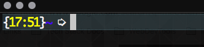
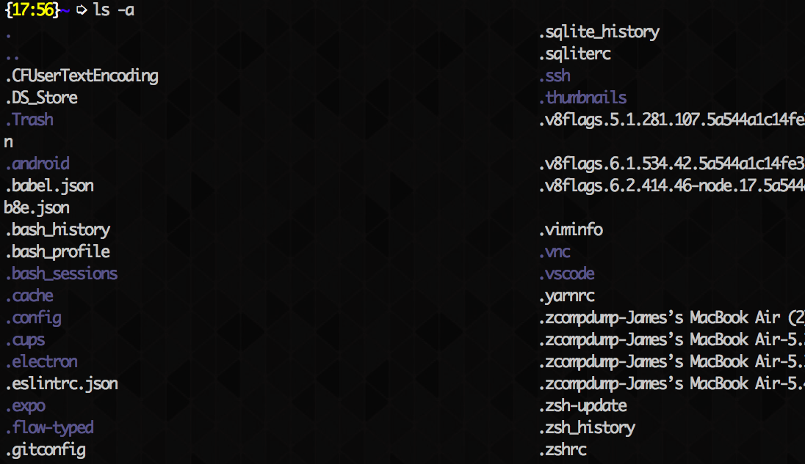

## Introduction

If you're reading this chances are you are very much like me: lazy and proud! Aliases are a great way for us lazy developers to minimize the number of keystrokes required to execute commands in the terminal and thus streamline our work and increase our productivity (or to continue being lazy but those sound better). Instead of executing `git checkout -b NewFeatureBranch` you could instead execute `gcb NewFeatureBranch`. Aliases are completely custom and can either be temporary or saved in your terminal's run commands, or `rc`, file. This article will cover creating and saving aliases in a Bash based terminal so this guide will theoretically work with all Mac computers and most, if not all, Linux based systems. Let's get started!

## Finding the Run Commands File

Alright, let's fire up the terminal and find our `rc` file. If you are using Bash you will be looking for the `.bashrc` file and if you're using ZSH you will be looking for the `.zshrc` file. If you are using a shell other than Bash or ZSH go ahead and visit the shells website to find out what the run commands filename is called but most likely it will look something like `.[SHELLNAME]rc`

In your terminal navigate to your home directory by typing `cd`. You'll know you're there if you see a `~` and only a `~`. It should look similar to the image below.

Now type in `ls -a` to list all of the files in the home directory. We need to add the `-a` flag to our list command to list both hidden and non-hidden files. This is because all files prefaced with a `.` like our `rc` file are hidden. We should see our `rc` file somewhere in this list. I am using a ZSH shell so my `rc` file is named `.zshrc`

Now open this file with Vim: `vim .zshrc`, Nano: `nano .zshrc`, or your favorite text editor. I am going to open it with VSCode because why not! Type in `code .zshrc` to open the file in VSCode. If this command doesn't work for you the VSCode `code` command hasn't been installed on your machine. You can follow [this guide](https://code.visualstudio.com/docs/setup/mac) to get that up and running if you so choose. You can now edit this file, but be careful! We don't want to mess anything up because this file will run every time we open a new instance of our terminal.

## Creating an Alias

I have my aliases saved at the very top of the `rc` file so I know exactly where to look if I want to add, edit, or delete an alias. You can put these aliases wherever you'd like within the `rc` file so long as it's not in a code block. Go ahead an scroll to the type of the file and type `# Aliases` and hit enter. This line of code, prefaced by a `#` is a comment in the Bash scripting language, which allows us to stay somewhat organized. Now we can create our aliases and save them all under our `# Aliases` section, woohoo! 

An alias is creating by typing: `alias aliasName=command`. So if you wanted to alias the command `git checkout -b` as `gcb` you would write `alias gcb=git checkout -b`. 

Congratulations, you now have the power to create aliases, so go ahead and create some! Once you are all finished you can close the text editor and head back to your terminal. Once there navigate back to your home directory and execute `source .[SHELLNAME].rc` to load the new aliases. The `source` command allows us to load any functions/aliases into the current shell script so you don't have to exit the terminal or logout to refresh the aliases.

That's it; you can now use your new aliased commands!